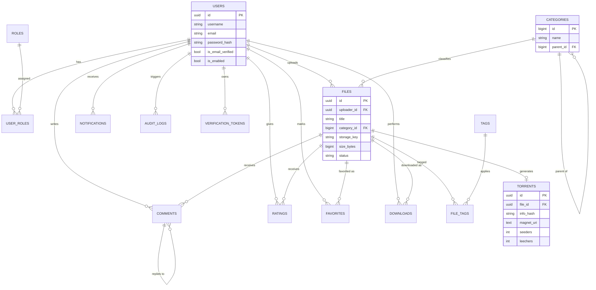
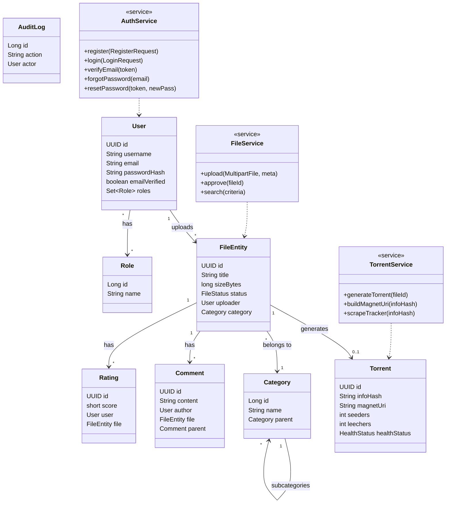
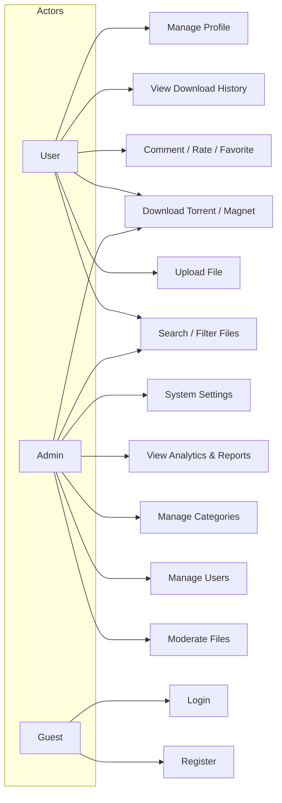
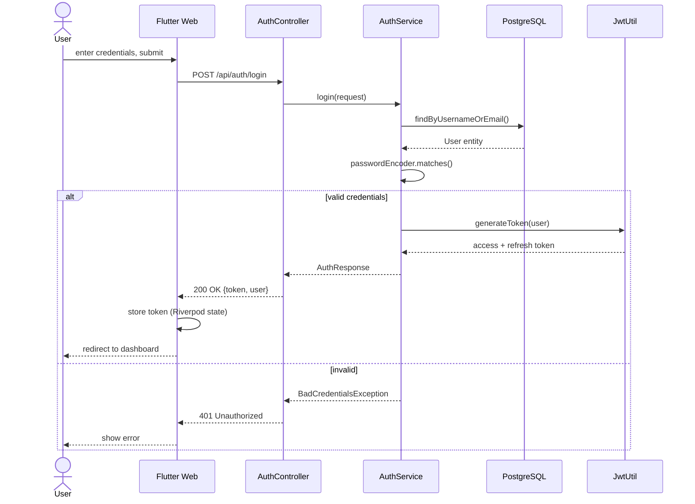
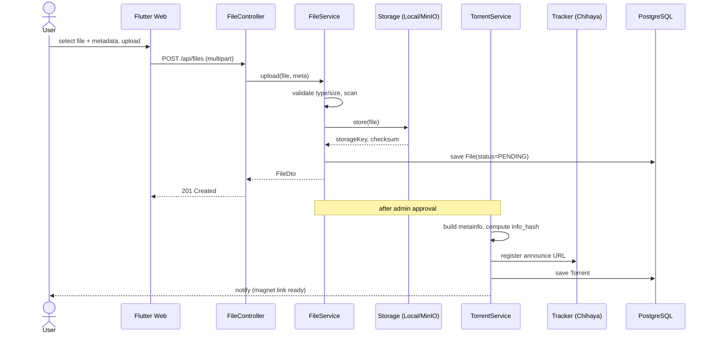
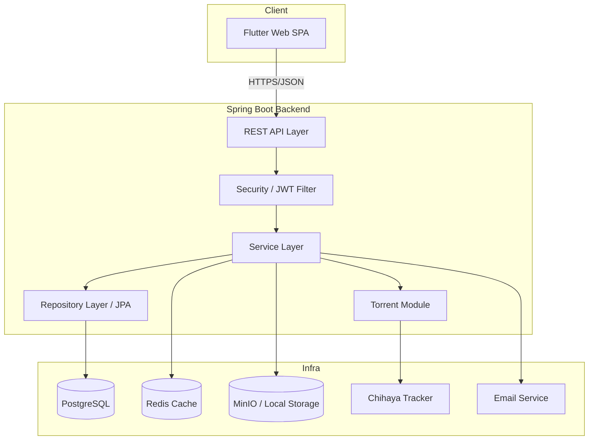
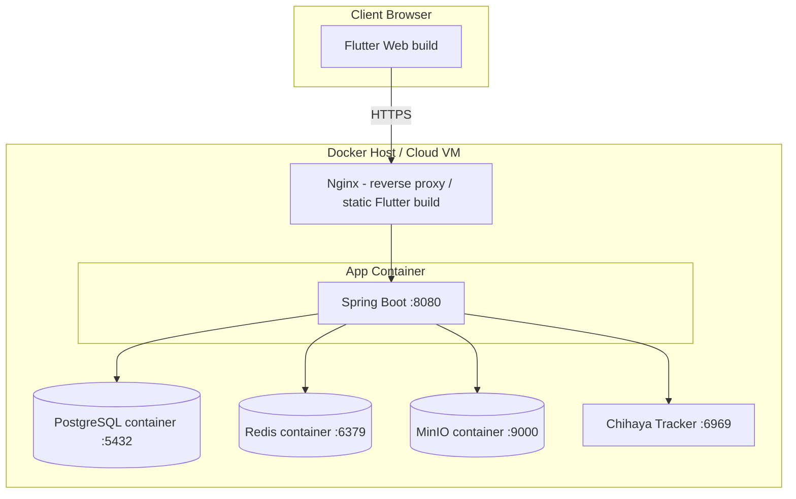

# PTDS — System Diagrams

Rendered as [Mermaid](https://mermaid.js.org/) — view in GitHub, GitLab, VS
Code (Mermaid extension), or https://mermaid.live.

## 1. ER Diagram

## 2. Class Diagram (Backend Domain Model)

## 3. Use Case Diagram

## 4. Sequence Diagram — Login (JWT)

## 5. Sequence Diagram — File Upload + Torrent Generation

## 6. Component Diagram

## 7. Deployment Diagram

